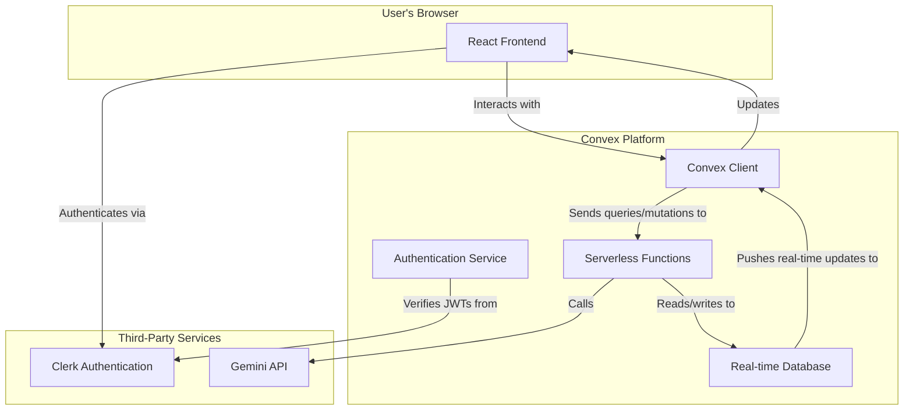
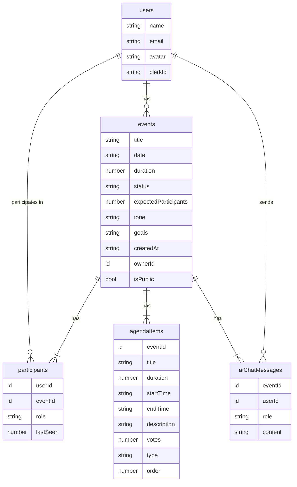

# Architecture Documentation

This document provides an overview of the system architecture for the EventFlow application.

## System Overview

EventFlow is a real-time, collaborative event planning application built on a modern, serverless stack. It enables users to create, manage, and share events, with features like agenda planning, participant management, and AI-powered assistance.

The architecture is designed to be scalable, maintainable, and provide a seamless, real-time user experience.

### Core Technologies

- **Frontend**: Built with TanStack Start, React.
- **Backend**: Powered by [Convex](https://convex.dev/), a serverless platform that provides a real-time database, serverless functions (mutations, queries, actions), and authentication.
- **Authentication**: Integrated with [Clerk](https://clerk.com/) for user management and authentication.
- **AI**: Utilizes the Gemini API for generative AI features, such as event planning assistance.

### System Diagram

## Database Schema

The database schema is defined in `convex/schema.ts` and managed by Convex. It consists of several tables that store the application's data. The relationships between these tables are key to understanding the application's data model.

### Schema with Relationships

## Real-time Collaboration

Real-time collaboration is a core feature of EventFlow, allowing multiple users to interact with the same event data simultaneously. This is achieved through Convex's real-time database capabilities.

1.  **Optimistic Updates**: When a user makes a change (e.g., adds an agenda item), the UI is updated immediately on the client-side. This is an "optimistic update."
2.  **Server-Side Execution**: The change is sent to a Convex mutation, which executes on the server, updating the database.
3.  **Real-time Sync**: Convex's real-time infrastructure automatically pushes the updated data to all connected clients that are subscribed to the relevant queries.
4.  **Conflict Resolution**: The client's optimistic update is replaced with the authoritative data from the server, ensuring all users see a consistent state.

This model provides a fast, responsive user experience while maintaining data consistency across all clients.

## AI Integration Architecture

The AI integration leverages the Gemini API to provide intelligent features, such as event planning suggestions and automated agenda creation.

1.  **User Interaction**: A user interacts with the AI chat interface in the frontend.
2.  **Mutation Call**: The frontend calls a Convex mutation (`sendMessage`) to store the user's message in the `aiChatMessages` table.
3.  **Action Trigger**: The `sendMessage` mutation schedules a Convex action (`getAIResponse`).
4.  **API Call**: The `getAIResponse` action communicates with the Gemini API, sending the user's prompt along with relevant context about the event.
5.  **Tool Usage**: The AI can use predefined "tools" to perform actions, such as creating agenda items. These tools are implemented as Convex mutations that the AI action can call.
6.  **Response Handling**: The AI's response is streamed back to the action, which then saves the assistant's message to the `aiChatMessages` table using an internal mutation.
7.  **Real-time Update**: The new message appears in the user's chat interface in real-time, thanks to Convex's reactive queries.

## Authentication Flow

Authentication is handled by Clerk, which provides a robust and secure user management solution.

1.  **Frontend Authentication**: The user signs in or signs up using the Clerk-provided UI components in the React frontend.
2.  **JWT Issuance**: Upon successful authentication, Clerk issues a JSON Web Token (JWT) to the client.
3.  **Authenticated Requests**: The Convex client automatically includes the JWT in the headers of all requests to the Convex backend.
4.  **Backend Verification**: The Convex backend is configured to use Clerk as a JWT provider. It verifies the signature and expiration of the JWT for every authenticated query and mutation.
5.  **User Identity**: Once the token is verified, the user's identity (including their Clerk ID) is available in the context of the Convex function, allowing for authorization and user-specific logic.
6.  **Webhook Sync**: When a new user signs up in Clerk, a webhook is sent to the Convex `clerkWebhook` HTTP action, which creates a corresponding user record in the `users` table.
